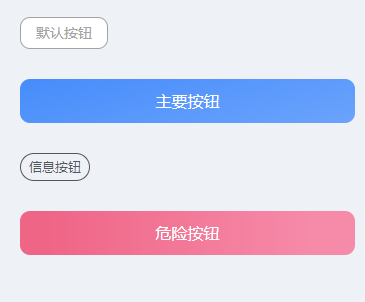

# van-button 定制调整

```html
<van-button type="default">默认按钮</van-button>

<van-button type="primary" block size="large">主要按钮</van-button>

<van-button type="info" plain round size="small">信息按钮</van-button>

<van-button type="danger" block size="large">危险按钮</van-button>
```

